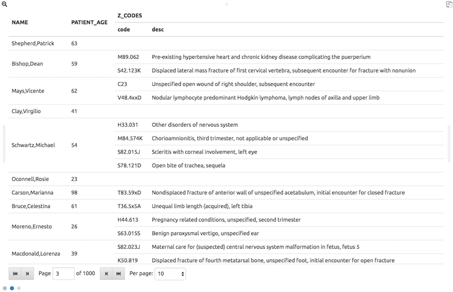
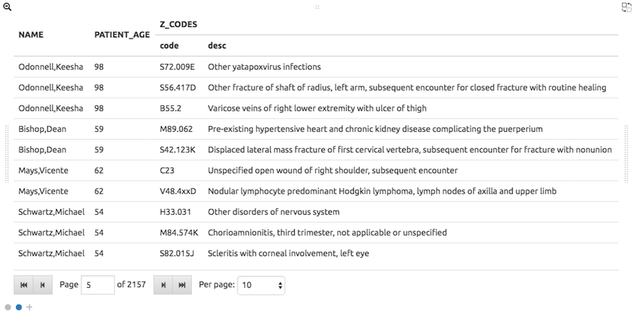
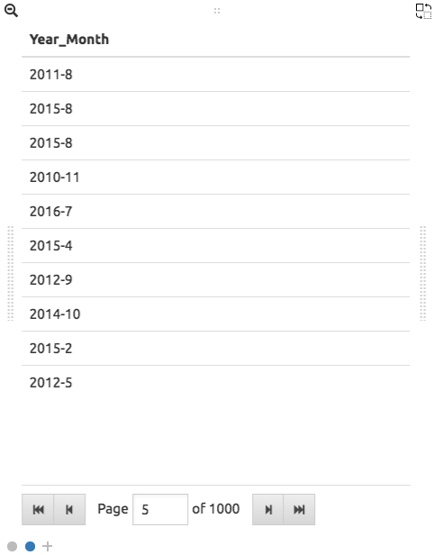
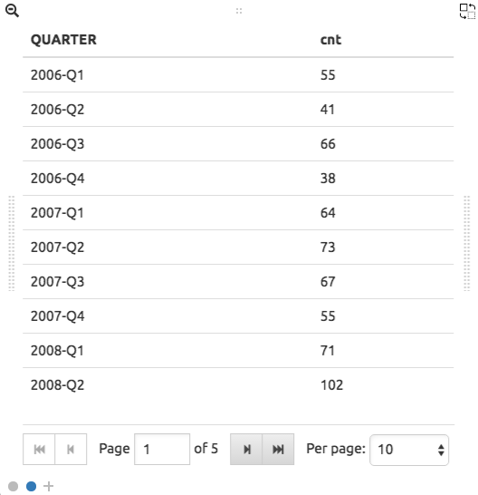
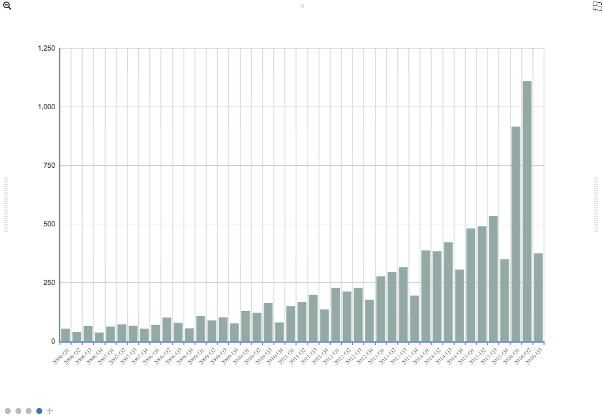

.. figure:: images/white-logo.png
   :alt: SlamData Logo

Helpful Tips
============

This Helpful Tips document provides SQL² snippets that
may not otherwise be covered in the other guides.  

For information on how to use SlamData from a user perspective
see the `SlamData Administration Guide <administration-guide.html>`__

For information on how to use SlamData from a user perspective
see the `SlamData Users Guide <users-guide.html>`__  (not implemented yet)

Examples in this guide will show the SQL² query as well as the generated
MongoDB query directly below it for reference.

Section 1 - Basic Queries
-------------------------

1.1 Counting
~~~~~~~~~~~~

1.1.1 Documents / Rows
''''''''''''''''''''''

**SQL Example**

.. code-block:: sql

    SELECT COUNT(*) FROM `/devguide/devdb/patients`

**MongoDB query equivalent**

.. code-block:: json

    db.patients.aggregate(
      [
        {
          "$group": {
            "0": { "$sum": { "$literal": NumberInt("1") } },
            "_id": { "$literal": null }
          }
        },
        { "$limit": NumberLong("11") }],
      { "allowDiskUse": true });

1.1.2 Documents / Rows with Filter
''''''''''''''''''''''''''''''''''

**SQL Example**

.. code-block:: sql

    SELECT COUNT(*)
    FROM `/devguide/devdb/patients`
    WHERE age >= 50

**MongoDB query equivalent**

.. code-block:: json

    db.patients.aggregate(
      [
        {
          "$match": {
            "$and": [
              {
                "$or": [
                  { "age": { "$type": NumberInt("16") } },
                  { "age": { "$type": NumberInt("18") } },
                  { "age": { "$type": NumberInt("1") } },
                  { "age": { "$type": NumberInt("2") } },
                  { "age": { "$type": NumberInt("9") } },
                  { "age": { "$type": NumberInt("8") } }]
              },
              { "age": { "$gte": NumberInt("50") } }]
          }
        },
        {
          "$group": {
            "0": { "$sum": { "$literal": NumberInt("1") } },
            "_id": { "$literal": null }
          }
        },
        { "$limit": NumberLong("11") }],
      { "allowDiskUse": true });

1.2 Concatenating Field Values
~~~~~~~~~~~~~~~~~~~~~~~~~~~~~~

Use the double-pipe (`||`) symbol to concatenate `char` and `string` values.

**SQL Example**

.. code-block:: sql

    SELECT
      "Full Name is " ||
      first_name      ||
      ' '             ||
      last_name
    FROM `/devguide/devdb/patients`

**MongoDB query equivalent**

.. code-block:: json

    db.patients.aggregate(
      [
        { "$limit": NumberLong("11") },
        {
          "$project": {
            "0": {
              "$cond": [
                {
                  "$and": [
                    { "$lte": [{ "$literal": "" }, "$last_name"] },
                    { "$lt": ["$last_name", { "$literal": {  } }] }]
                },
                {
                  "$cond": [
                    {
                      "$and": [
                        { "$lte": [{ "$literal": "" }, "$first_name"] },
                        { "$lt": ["$first_name", { "$literal": {  } }] }]
                    },
                    {
                      "$concat": [
                        {
                          "$concat": [
                            {
                              "$concat": [{ "$literal": "Full Name is " }, "$first_name"]
                            },
                            { "$literal": " " }]
                        },
                        "$last_name"]
                    },
                    { "$literal": undefined }]
                },
                { "$literal": undefined }]
            }
          }
        }],
      { "allowDiskUse": true });

1.3 Converting Data Types
~~~~~~~~~~~~~~~~~~~~~~~~~

SlamData provides the ability to convert between many data types:

1.3.1 TO_STRING() Function
''''''''''''''''''''''''''

Any data type can be turned into a string data type using the [``TO_STRING()``] function:

**SQL Example**

.. code-block:: sql

    SELECT
      TO_STRING(DATE_PART("year", last_visit))  ||
      "-"                                       ||
      TO_STRING(DATE_PART("month", last_visit)) AS Year_Month
    FROM `/devguide/devdb/patients`

**Example Output**

|Year-Month|

**MongoDB query equivalent**

.. code-block:: json

    db.patients.mapReduce(
      function () {
        emit.apply(
          null,
          (function (key, value) {
            return [
              key,
              {
                "Year_Month": (((value.last_visit instanceof Date) || (value.last_visit instanceof Timestamp)) && ((value.last_visit instanceof Date) || (value.last_visit instanceof Timestamp))) ? ((((value.last_visit.getFullYear() instanceof NumberInt) || (value.last_visit.getFullYear() instanceof NumberLong)) ? String(value.last_visit.getFullYear()).replace(
                  RegExp("[^-0-9]+", "g"),
                  "") : ((value.last_visit.getFullYear() instanceof Timestamp) || (value.last_visit.getFullYear() instanceof Date)) ? value.last_visit.getFullYear().toISOString() : String(value.last_visit.getFullYear())) + "-") + ((((value.last_visit.getMonth() + 1) instanceof NumberInt) || ((value.last_visit.getMonth() + 1) instanceof NumberLong)) ? String(value.last_visit.getMonth() + 1).replace(
                  RegExp("[^-0-9]+", "g"),
                  "") : (((value.last_visit.getMonth() + 1) instanceof Timestamp) || ((value.last_visit.getMonth() + 1) instanceof Date)) ? (value.last_visit.getMonth() + 1).toISOString() : String(value.last_visit.getMonth() + 1)) : undefined
              }]
          })(
            this._id,
            this))
      },
      function (key, values) { return values[0] },
      {
        "out": { "replace": "tmp.gen_840a7e9a_0", "db": "devdb" },
        "limit": NumberLong("11")
      });
    db.tmp.gen_840a7e9a_0.aggregate(
      [{ "$project": { "Year_Month": "$value.Year_Month" } }],
      { "allowDiskUse": true });

1.3.2 TO_TIMESTAMP() Function
'''''''''''''''''''''''''''''

An epoch data type can be converted into a TIMESTAMP data type using the [``TO_TIMESTAMP()``] function.

Assuming a collection has documents which contain a field ``epoch`` with values such as ``1408255200000``:

**SQL Example**

.. code-block:: sql

    SELECT *
    FROM `/devguide/epochtest/c1`
    WHERE TO_TIMESTAMP(epoch) <= TIMESTAMP("2016-01-01T00:00:00Z")

**MongoDB query equivalent**

.. code-block:: json

    db.c1.aggregate(
      [
        {
          "$project": {
            "__tmp2": {
              "$cond": [
                {
                  "$and": [
                    { "$lt": [{ "$literal": null }, "$epoch"] },
                    { "$lt": ["$epoch", { "$literal": "" }] }]
                },
                {
                  "$lte": [
                    {
                      "$add": [{ "$literal": ISODate("1970-01-01T00:00:00Z") }, "$epoch"]
                    },
                    { "$literal": ISODate("2016-01-01T00:00:00Z") }]
                },
                { "$literal": undefined }]
            },
            "__tmp3": "$$ROOT"
          }
        },
        { "$match": { "__tmp2": true } },
        { "$limit": NumberLong("11") },
        { "$project": { "value": "$__tmp3", "_id": false } }],
      { "allowDiskUse": true });

1.4 Grouping
~~~~~~~~~~~~

1.4.1 By Calendar Quarter
'''''''''''''''''''''''''

Assume you have documents in a structure similar to the following:

.. code-block:: json

  {
    "_id": ObjectId("...abcd1234..."),
    ...
    "city": "AUSTIN",
    "first_name": "John",
    "last_name": "Smith",
    "middle_name": "Duke",
    "last_visit": ISODate("2016-01-01T15:56:36Z"),
    "weight": 145
    ...
  }

We can generate a concise report showing how many patients
visited per quarter, per year.  This requires use of the ``TO_STRING()``
and ``DATE_PART()`` functions, as well as the modulus (``%``) operator
to assist in rounding.

First section of query:

.. code-block:: sql

    SELECT
      COUNT(*) as cnt,
      TO_STRING(DATE_PART("year",last_visit))
      || "-Q" ||
      TO_STRING((DATE_PART("quarter",last_visit)) - (DATE_PART("quarter",last_visit) %1)) AS QUARTER

Line 3: Converts the "year" portion of the last_visit field to a string

Line 4: Concatenates "-Q" to the output of Line 3

Line 5: Rounds the month to the quarter, then concatenates the output to Lines 3 and 4 and assigns the alias ``QUARTER``

.. code-block:: sql

    FROM `/devguide/devdb/patients`
    GROUP BY
      TO_STRING(DATE_PART("year",last_visit))
      || "-Q" ||
      TO_STRING((DATE_PART("quarter",last_visit)) - (DATE_PART("quarter",last_visit) %1))
    ORDER BY QUARTER ASC

The ``GROUP BY`` clause is used here to group all quarterly entries together.  The same functions are used here that are used in the ``SELECT`` clause for consistency.  Currently aliases cannot be used in ``GROUP BY`` clauses as they can in ``ORDER BY`` clauses.

Line 1: fetches from the appropriate collection

Line 2: Starts the ``GROUP BY`` clause

Line 3: Similar to Line 3 in the previous example, converts the "year" portion of the last_visit field to a string.

Line 4: Concatenates "-Q" to the output of Line 3

Line 5: Rounds the month to the quarter, then concatenates the output to Lines 3 and 4

Line 6: Orders the results based on yearly quarters in ascending order

**Full SQL example:**

.. code-block:: sql

    SELECT
      COUNT(*) as cnt,
      TO_STRING(DATE_PART("year",last_visit))
      || "-Q" ||
      TO_STRING((DATE_PART("quarter",last_visit)) - (DATE_PART("quarter",last_visit) %1)) AS QUARTER
    FROM `/devguide/devdb/patients`
    GROUP BY
      TO_STRING(DATE_PART("year",last_visit))
      || "-Q" ||
      TO_STRING((DATE_PART("quarter",last_visit)) - (DATE_PART("quarter",last_visit) %1))
    ORDER BY QUARTER ASC

Results in the following table:

|Quarter-Year-Group-By|

When these results are placed into a bar chart it would look similar to this:

|Quarter-Year-Group-By-Chart|

Section 2 - Complex Queries
---------------------------

This section goes into more advanced queries that include documents with
nested data, documents that utilize schema as data, and multicollection
JOINs.

The following examples assume a document structure similar to the following:

**NOTE**: this is fictitious sample data, randomly generated

.. code-block:: json

  {
    "_id": ObjectId("5781ae797689630b25452c73"),
    "city": "COLONIA",
    "first_name": "Keesha",
    "last_name": "Odonnell",
    "middle_name": "Alice",
    "last_visit": ISODate("2016-01-01T15:56:36Z"),
    "weight": 145,
    "loc": [
      -74.314688,
      40.590853
    ],
    "gender": "female",
    "age": 98,
    "previous_visits": [
      ISODate("2009-02-14T15:09:30Z"),
      ISODate("2006-02-23T17:45:05Z")
    ],
    "height": 61,
    "county": "MIDDLESEX",
    "state": "NJ",
    "ssn": "383-97-3804",
    "previous_addresses": [
      {
        "city": "HUDSON",
        "longitude": -108.582745,
        "county": "FREMONT",
        "state": "WY",
        "latitude": 42.900791,
        "zip_code": 82515
      },
      {
        "city": "SMYRNA",
        "longitude": -75.565131,
        "county": "KENT",
        "state": "DE",
        "latitude": 39.194026,
        "zip_code": 19977
      },
      {
        "city": "ZOAR",
        "longitude": -81.414245,
        "county": "TUSCARAWAS",
        "state": "OH",
        "latitude": 40.61829,
        "zip_code": 44697
      }
    ],
    "codes": [
      {
        "code": "S72.001C",
        "desc": "Displaced fracture of medial malleolus of right tibia, subsequent encounter for open fracture type IIIA, IIIB, or IIIC with routine healing"
      },
      {
        "code": "S72.009E",
        "desc": "Other yatapoxvirus infections"
      },
      {
        "code": "S56.417D",
        "desc": "Other fracture of shaft of radius, left arm, subsequent encounter for closed fracture with routine healing"
      },
      {
        "code": "B55.2",
        "desc": "Varicose veins of right lower extremity with ulcer of thigh"
      }
    ],
    "street_address": "8320 45TH ST",
    "zip_code": 7067
  }

1.2 Nested Data
~~~~~~~~~~~~~~~

SlamData provides the flattening operator (``[*]``) to iterate through arrays and
extract values from fields.

1.2.1 Return Nested Array
'''''''''''''''''''''''''

Querying documents with arrays without the (``[*]``) operator results in an
array being returned, see the following SQL² and resulting image.  Compare
this to section 1.2.2 Return Flattened Array.

**SQL Example**

.. code-block:: sql

    SELECT
      last_name || "," || first_name AS NAME,
      age AS PATIENT_AGE,
      codes AS Z_CODES
    FROM `/devguide/devdb/patients`

**Example Output**

|Return-Nested-Array|

**MongoDB query equivalent**

.. code-block:: json

    db.patients.aggregate(
      [
        { "$limit": NumberLong("11") },
        {
          "$project": {
            "NAME": {
              "$cond": [
                {
                  "$and": [
                    { "$lte": [{ "$literal": "" }, "$first_name"] },
                    { "$lt": ["$first_name", { "$literal": {  } }] }]
                },
                {
                  "$cond": [
                    {
                      "$and": [
                        { "$lte": [{ "$literal": "" }, "$last_name"] },
                        { "$lt": ["$last_name", { "$literal": {  } }] }]
                    },
                    {
                      "$concat": [
                        { "$concat": ["$last_name", { "$literal": "," }] },
                        "$first_name"]
                    },
                    { "$literal": undefined }]
                },
                { "$literal": undefined }]
            },
            "PATIENT_AGE": "$age",
            "Z_CODES": "$codes"
          }
        }],
      { "allowDiskUse": true });

1.2.2 Return Flattened Array
''''''''''''''''''''''''''''

Compare the output of this section to section 1.2.1 Return Nested Array.  The
difference is that in this example there is one row per patient, per diagnosis.

**SQL Example**

.. code-block:: sql

    SELECT
      last_name || "," || first_name AS NAME,
      age AS PATIENT_AGE,
      codes[*] AS Z_CODES
    FROM `/devguide/devdb/patients`

**Example Output**

|Return-Flattened-Array|

**MongoDB query equivalent**

Notice the inclusion of the *$unwind* MongoDB operator in the generated code below now:

.. code-block:: json

    db.patients.aggregate(
      [
        {
          "$project": {
            "__tmp8": {
              "$cond": [
                {
                  "$and": [
                    { "$lte": [{ "$literal": [] }, "$codes"] },
                    { "$lt": ["$codes", { "$literal": BinData(0, "") }] }]
                },
                "$codes",
                { "$literal": [undefined] }]
            },
            "__tmp9": "$$ROOT"
          }
        },
        { "$unwind": "$__tmp8" },
        { "$limit": NumberLong("11") },
        {
          "$project": {
            "NAME": {
              "$cond": [
                {
                  "$and": [
                    { "$lte": [{ "$literal": "" }, "$__tmp9.first_name"] },
                    { "$lt": ["$__tmp9.first_name", { "$literal": {  } }] }]
                },
                {
                  "$cond": [
                    {
                      "$and": [
                        { "$lte": [{ "$literal": "" }, "$__tmp9.last_name"] },
                        { "$lt": ["$__tmp9.last_name", { "$literal": {  } }] }]
                    },
                    {
                      "$concat": [
                        { "$concat": ["$__tmp9.last_name", { "$literal": "," }] },
                        "$__tmp9.first_name"]
                    },
                    { "$literal": undefined }]
                },
                { "$literal": undefined }]
            },
            "PATIENT_AGE": "$__tmp9.age",
            "Z_CODES": "$__tmp8"
          }
        },
        {
          "$project": { "NAME": true, "PATIENT_AGE": true, "Z_CODES": true, "_id": false }
        }],
      { "allowDiskUse": true });

