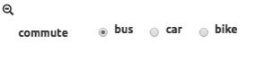
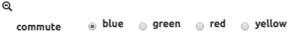
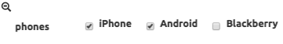
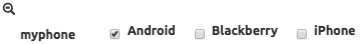
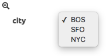
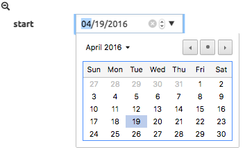
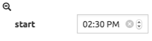

.. figure:: images/white-logo.png
   :alt: SlamData Logo

Reference - SlamDown
====================

This SlamDown Reference can assist with the proper formatting of
SlamDown code to produce static and interactive forms within SlamData.


Section 1 - Introduction
------------------------

SlamData contains its own markup language called SlamDown, which is
useful for creating reports and forms. SlamDown is a subset of
`CommonMark <http://commonmark.org/>`__, a specification for a highly
compatible implementation of
`Markdown <https://en.wikipedia.org/wiki/Markdown>`__.

In addition, SlamDown also includes two extensions to CommonMark: `form
fields <#form-elements>`__ and `evaluated SQL² queries <#evaluated-sql-query>`__.


Section 2 - Block Elements
--------------------------

The following SlamDown elements create blocks of content.


2.1 Horizontal Rules
~~~~~~~~~~~~~~~~~~~~

Three dashes or more create a horizontal line. Put a blank line above
and below the dashes.

::

    Text here

    ---

    More text here

results in:

Text here

--------------

More text here


2.2 Headers
~~~~~~~~~~~

Use hash marks (``#``) for `ATX
headers <http://spec.commonmark.org/0.22/#atx-header>`__, with one
hashmark for each level.

::

    # Top level  
    ## Second level
    ### Third level  

results in a first, second, and third level heading:

.. figure:: images/screenshots/fake-levels.png
   :alt: Headers

   Headers


2.3 Code Blocks
~~~~~~~~~~~~~~~

You can create blocks of code (that is, literal content in monospace
font) in two ways:

**Indented code blocks**

Indent by four spaces.

.. raw:: html

   <pre>
       for (int i =0; i < 10; i++)
           sum += myArray[i];
   </pre>

**Fenced code blocks**

Start and end with three or more backtick (\`) characters.

::

    ```
    for (int i =0; i < 10; i++)
        sum += myArray[i];
    ```

Both Indented Code Blocks and Fenced Code Blocks result in:

::

    for (int i =0; i < 10; i++)
       sum += myArray[i];


2.4 Paragraphs
~~~~~~~~~~~~~~

Paragraphs are separated by a blank line.

::

    This is paragraph 1.

    This is paragraph 2.

results in:

This is paragraph 1.

This is paragraph 2.


2.5 Block quotes
~~~~~~~~~~~~~~~~

Start with a greater than sign (``>``) to create a block quote.

::

    > This is a block quote.

results in:

    This is a block quote.


2.6 Lists
~~~~~~~~~

Ordrered lists start with numbers followed by periods. The actual
numbers in the SlamDown do not matter. In the end, they will be
displayed with ascending indices.

::

    1. First item
    2. Second item
    3. Third item

results in:

1. First item
2. Second item
3. Third item

Unordered lists start with either asterisks (``*``), dashes (``-``), or
pluses (``+``). They are interchangeable.

::

    * First item
    * Second item
    * Third item

results in:

-  First item
-  Second item
-  Third item


Section 3 - Inline Elements
---------------------------

The following inline elements are supported in SlamDown. In addition to
standard Markdown elements, there is also the ability to `evaluate a SQL
query <#evaluated-sql-query>`__ and put the result into the content.


3.1 Emphasis and Strong Emphasis
~~~~~~~~~~~~~~~~~~~~~~~~~~~~~~~~

Surround content with asterisks (``*``) for emphasis and surround it
with double asterisks (``**``) for strong emphasis.

::

    This is *important*. This is **more important**.

results in:

This is *important*. This is **more important**.


3.2 Links
~~~~~~~~~

Links contain the link title in square brackets (``[]``) and the link
destination in parentheses (``()``).

::

    [SlamData](http://slamdata.com)

results in:

`SlamData <http://slamdata.com>`__

If the link title and destination are the same, you can use an autolink,
where the URI is contained in angle brackets (``<>``).

::

    <http://slamdata.com>

results in:

http://slamdata.com


3.3 Images
~~~~~~~~~~

Images start with an explanation mark (``!``), followed by the image
description in square brackets (``[]``) and the image URI in parentheses
(``()``).

::

    

results in:

|LogoLink|

.. |LogoLink| image:: https://media.licdn.com/media/p/6/005/088/002/039b9f8.png


3.4 Inline code formatting
~~~~~~~~~~~~~~~~~~~~~~~~~~

To add code formatting (literal content with monospace font) inline, put
the content between backtick (\`) characters.

::

    Start SQL statements with `SELECT * FROM`

results in:

Start SQL statements with ``SELECT * FROM``


Section 4 - Evaluated SQL² Queries
----------------------------------

SlamDown extends Markdown by allowing you to evaluate a SQL² query and
insert the results into the rendered content, including the form
elements listed in Seciton 5 below. Start the query with an
exclamation point and then contain the SQL² query between double backtick
(``````) characters.

.. hint:: **Backticks**

	Notice how the path to the query below has a space between the
	backtick that ends the path (`````) and the double backticks (``````)
	that end the query.
	This is a necessary space because three backticks in a row start a
	Fenced Code Block as stated above.

In the example below, if there are 20 documents in the ``/col`` file, :then

::

    There are !``SELECT COUNT(*) FROM `/col` `` documents inside the collection.

results in:

There are ``20`` documents inside the collection.

SQL² queries are always surrounded by double backticks (``````) and
preceded with an exclamation point (``!``).  Additionally, they
may be surrounded by parentheses (``()``) for radio buttons,
braces (``{}``) for dropdowns, and brackets (``[]``) for check boxes
as seen in later sections.


Section 5 - Form Elements
-------------------------

Provide interactive forms for your users with text fields,
date pickers, check boxes and more.

First define a variable name in Slamdown and then define the 
element type based on the formatting in the sections below.

For instance:

::

	name = ____

This defines the variable ``name`` and creates a simple text
entry field in the browser.  You can then utilize this variable
in a Query Card like this:

.. code-block:: sql

	SELECT address, phone_number, city, state
	FROM `/mydb/mytable`
	WHERE fullname = :name

Make sure to precede the variable name with a colon (``:``) when
referencing it as a variable inside of a Query Card.


5.1 Text Field
~~~~~~~~~~~~~~

Use one or more underscores (``_``) to create a text input field where a
user can add text.

For example, this line creates an input file for a user's interests. You can then
refer to the value as ``:interests``

::

    interests = ________

Optionally, you can pre-fill the input field with a default value by
having it after the underscores in parentheses. This line creates an
input field ``interests`` with a default value of "SlamData". You can then
refer to the value as ``:interests``

::

    interests = ________ (SlamData)


5.2 Numeric Field
~~~~~~~~~~~~~~~~~

By default input fields are evaluated as String types. To enforce a
numeric type prefix the underscores with the (``#``) symbol. You
may also provided a default value for this field as well.  For
example:

::

    year = #________  (1999)


5.3 Radio Buttons
~~~~~~~~~~~~~~~~~

A set of radio buttons has only one button selected at a time.  Radio buttons
can be populated with static content or populated with a query.  See the
follow sections.


5.3.1 Static Radio Buttons
''''''''''''''''''''''''''

Use parentheses followed by text to indicate radio buttons.  Indicate which
button is selected by putting an ``x`` in the parentheses.

For example, this line creates a set of radio buttons with the values
"car", "bus", and "bike", where "car" is marked as the default. The
result is stored in the string variable named ``commute`` for later use.

::

    commute = () car (x) bus () bike

This results in:

|Radio-Buttons-Static|

Notice how the default selection became the first selection in the
actual rendered set.


5.3.2 Dynamic Radio Buttons
'''''''''''''''''''''''''''

As with all other form elements, radio buttons may be populated by
means of an evaluated SQL² query.

For example, this Slamdown code creates a set of radio buttons that
list the unique color values in a database:

.. code-block:: sql

	mycolor =
	(!``SELECT DISTINCT(color) FROM `/devguide/devdb/colors` ORDER BY color ASC LIMIT 1``)
	!``SELECT DISTINCT(color) FROM `/devguide/devdb/colors` ORDER BY color ASC``

First notice how the field is defined on multiple lines.

Next you can see two queriesnow instead of one.  The first query defines which value
is selected by default, the second defines the remaining values.  This results in:

|Radio-Buttons-Dynamic|


5.4 Checkboxes
~~~~~~~~~~~~~~

Use brackets (``[]``) followed by text to indicate checkboxes.
In a set of checkboxes each checkbox operates independently.

.. hint:: **Array Evaluation**

	When referring to a variable that is an array, which is what
	a checkbox variable is, the variable must be followed by
	the ``[_]`` operator.  See query example below.

A checkbox array variable can be used in a query whether it was
defined statically in Slamdown or dynamically through an evaluated
SQL² query.  An example query within a Query Card would look like this.

::

	SELECT * FROM `/mydb/mytable` WHERE phone IN :phones[_]


5.4.1 Static Check Boxes
''''''''''''''''''''''''

Use an ``x`` in the square brackets to indicate that the checkbox
should be checked by default. The string value returned will be an
array of strings in brackets.

For example, this line creates a set of checkboxes with the values
"Android", "iPhone", and "Blackberry". The result is stored in the
string variable named ``phones`` for later use.

::

	phones = [x] iPhone [] Blackberry [x] Android 

This results in:

|Check-Boxes-Static|

Similar to radio buttons, notice that the fields preselected with an ``x`` as
are rendered first.

The selections above would result in the ``phones`` variable containing
a value of the following array:  [``"iPhone"``, ``"Blackberry"``]


5.4.2 Dynamic Check Boxes
'''''''''''''''''''''''''

As with all other form elements, checkboxes may be populated by
means of an evaluated SQL² query.

For example, this Slamdown code creates a set of checkboxes that
list the phone types within a database:

.. code-block:: sql

	myphone =
	[!``SELECT DISTINCT(phone) FROM `/mydb/mytable` ORDER BY phone ASC LIMIT 1``]
	!``SELECT DISTINCT(phone) FROM `/mydb/mytable` ORDER BY phone ASC``

This results in:

|Check-Boxes-Dynamic|

The first query defines which value is selected by default, the second query
populates the remaining checkboxes.


5.5 Dropdowns
~~~~~~~~~~~~~

Dropdowns allow users to select one (and only one) value from a list
of options, similar to radio buttons.  Unlike radio buttons, however,
dropdown elements typically take up less space in the browser and
are more suitable to longer lists of values.

Use a comma-separated list in braces (``{}``) to indicate a dropdown
element.

.. hint:: **Array Evaluation**

	When referring to a variable that is an array, which is what
	a dropdown variable is, the variable must be followed by
	the ``[_]`` operator.  See query example below.

A dropdown array variable can be used in a query whether it was
defined statically in Slamdown or dynamically through an evaluated
SQL² query.  An example query within a Query Card would look like this.

::

	SELECT * FROM `/mydb/mytable` WHERE city IN :mycity[_]


5.5.1 Static Dropdown
'''''''''''''''''''''

Define a static dropdown element by placing the values of array
elements within braces (``{}``).

For example, this line creates a dropdown element with BOS, SFO, and NYC
entries. The result is stored in an array variable named ``city`` for
later use.

::

    city = {BOS, SFO, NYC}

This results in:

|Dropdown-Static|

Optionally, include a default value by listing it in parentheses at the
end. In this line, NYC is set as the default.

::

    city = {BOS, SFO, NYC} (NYC)


5.5.2 Dynamic Dropdown
''''''''''''''''''''''

As with all other form elements, dropdown elements may be populated by
means of an evaluated SQL² query.

For example, this Slamdown code creates a dropdown that contains the
names of cities within a database:

.. code-block:: sql

	mycity = {!``SELECT DISTINCT(city) FROM `/mydb/mytable` ORDER BY city ASC``}


5.6 Dates and Times
~~~~~~~~~~~~~~~~~~~

Provide a date, time or both date & time selector for users by
implementing the following syntax.


5.6.1 Date
''''''''''

The following example creates a date selector element and
stores the value in a variable called ``start``:

::

	start = ____-__-__ (2016-04-19)

This results in:

|Date-Only|


5.6.2 Time
''''''''''

The following lines creates a time selector element:

::

	start = __:__ (12:30 PM)

This results in:

|Time-Only|


5.6.3 Date & Time (TIMESTAMP)
'''''''''''''''''''''''''''''

The following line creates both a date and time selector element:

::

	start = ____-__-__ __:__ (2016-04-19 14:00)

This results in:

|Date-And-Time|
















.. |Date-And-Time| image:: images/SD3/screenshots/date-and-time.png
