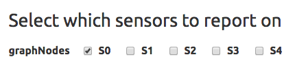

.. figure:: images/white-logo.png
   :alt: SlamData Logo

Reference - SlamDown
====================

This SlamDown Reference can assist with the proper formatting of
SlamDown code to produce static and interactive forms within SlamData.

Introduction
------------

SlamData contains its own markup language called SlamDown, which is
useful for creating reports and forms. SlamDown is a subset of
`CommonMark <http://commonmark.org/>`__, a specification for a highly
compatible implementation of
`Markdown <https://en.wikipedia.org/wiki/Markdown>`__.

In addition, SlamDown also includes two extensions to CommonMark: `form
fields <#form-elements>`__ and `evaluated SQL2 queries <#evaluated-sql-query>`__.

This reference contains the following sections:

Block Elements
--------------

The following SlamDown elements create blocks of content.

Horizontal Rules
~~~~~~~~~~~~~~~~

Three dashes or more create a horizontal line. Put a blank line above
and below the dashes.

::

    Text here

    ---

    More text here

results in:

Text here

--------------

More text here

Headers
~~~~~~~

Use hash marks (``#``) for `ATX
headers <http://spec.commonmark.org/0.22/#atx-header>`__, with one
hashmark for each level.

::

    # Top level  
    ## Second level
    ### Third level  

results in a first, second, and third level heading:

.. figure:: images/screenshots/fake-levels.png
   :alt: Headers

   Headers

Code Blocks
~~~~~~~~~~~

You can create blocks of code (that is, literal content in monospace
font) in two ways:

**Indented code blocks**

Indent by four spaces.

.. raw:: html

   <pre>
       for (int i =0; i < 10; i++)
           sum += myArray[i];
   </pre>

**Fenced code blocks**

Start and end with three or more backtick (\`) characters.

::

    ```
    for (int i =0; i < 10; i++)
        sum += myArray[i];
    ```

Both Indented Code Blocks and Fenced Code Blocks result in:

::

    for (int i =0; i < 10; i++)
       sum += myArray[i];

Paragraphs
~~~~~~~~~~

Paragraphs are separated by a blank line.

::

    This is paragraph 1.

    This is paragraph 2.

results in:

This is paragraph 1.

This is paragraph 2.

Block quotes
~~~~~~~~~~~~

Start with a greater than sign (``>``) to create a block quote.

::

    > This is a block quote.

results in:

    This is a block quote.

Lists
~~~~~

Ordrered lists start with numbers followed by periods. The actual
numbers in the SlamDown do not matter. In the end, they will be
displayed with ascending indices.

::

    1. First item
    2. Second item
    3. Third item

results in:

1. First item
2. Second item
3. Third item

Unordered lists start with either asterisks (``*``), dashes (``-``), or
pluses (``+``). They are interchangeable.

::

    * First item
    * Second item
    * Third item

results in:

-  First item
-  Second item
-  Third item

Inline Elements
---------------

The following inline elements are supported in SlamDown. In addition to
standard Markdown elements, there is also the ability to `evaluate a SQL
query <#evaluated-sql-query>`__ and put the result into the content.

Emphasis and Strong Emphasis
~~~~~~~~~~~~~~~~~~~~~~~~~~~~

Surround content with asterisks (``*``) for emphasis and surround it
with double asterisks (``**``) for strong emphasis.

::

    This is *important*. This is **more important**.

results in:

This is *important*. This is **more important**.

Links
~~~~~

Links contain the link title in square brackets (``[]``) and the link
destination in parentheses (``()``).

::

    [SlamData](http://slamdata.com)

results in:

`SlamData <http://slamdata.com>`__

If the link title and destination are the same, you can use an autolink,
where the URI is contained in angle brackets (``<>``).

::

    <http://slamdata.com>

results in:

http://slamdata.com

Images
~~~~~~

Images start with an explanation mark (``!``), followed by the image
description in square brackets (``[]``) and the image URI in parentheses
(``()``).

::

    

results in:

|LogoLink|

.. |LogoLink| image:: https://media.licdn.com/media/p/6/005/088/002/039b9f8.png


Inline code formatting
~~~~~~~~~~~~~~~~~~~~~~

To add code formatting (literal content with monospace font) inline, put
the content between backtick (\`) characters.

::

    Start SQL statements with `SELECT * FROM`

results in:

Start SQL statements with ``SELECT * FROM``

Evaluated SQL Query
~~~~~~~~~~~~~~~~~~~

SlamDown extends CommonMark by allowing you to evaluate a SQL query and
insert the results into the rendered content. Start the query with an
exclamation point and then contain the SQL query between double backtick
(\`) characters.

Note: > Notice how the path to the query below has a space between the
backtick that ends the path and the double backticks that end the query.
This is a necessary space because three backticks in a row start a
Fenced Code Block as stated above.

In the example below, if there are 20 documents in the ``/col`` file,
then

::

    There are !``SELECT COUNT(*) FROM `/col` `` documents inside the collection.

results in:

There are ``20`` documents inside the collection.

Form Elements
-------------

SlamDown contains a significant addition to CommonMark, which are form
elements. This allows for the creation of interactive reports.

Text Field
~~~~~~~~~~

Use one or more underscores (``_``) to create a text input field where a
user can add text.

For example, this line creates an input file for a name. You can then
refer to the user value with the string variable name ``name``.

::

    name = ________

Optionally, you can pre-fill the input field with a default value by
having it after the underscores in parentheses. This line creates an
input file for spouse name with a default value of "none". You can then
refer to the user value with the string variable name ``spouse``.

::

    spouse = ________ (none)

By default input fields are evaluated as String types. To enforce a
numeric type prefix the underscores with the (``#``) symbol. For
example:

::

    year = #________

Radio Buttons
~~~~~~~~~~~~~

Use parentheses followed by text to indicate radio buttons. A set of
radio buttons has only one button selected at a time. Indicate which
button is selected by putting an ``x`` in the parentheses.

For example, this line creates a set of radio buttons with the values
"car", "bus", and "bike", where "car" is marked as the default. The
result is stored in the string variable named ``commute`` for later use.

::

    commute = (x) car () bus () bike

This results in:

.. figure:: images/screenshots/radio-buttons.png
   :alt: Radio Buttons

   Radio Buttons

**Note:** Currently, the default value must be the first value.


Dynamic Radio Buttons
~~~~~~~~~~~~~~~~~~~~~

The results of a SQL² query can be used to dynamically populate a set of
Radio Buttons. For example, this Markdown code creates a variable called `graphNode`
that displays all of the sensors in a database, allowing a user to select which
specific node to visualize in a chart:

::

  graphNode =
  (!``SELECT DISTINCT sensor FROM `/macbook/tsdemo/timeseries` ORDER BY sensor ASC LIMIT 1``)
  !``SELECT DISTINCT sensor FROM `/macbook/tsdemo/timeseries` ORDER BY sensor ASC``

This results in:

.. figure:: images/screenshots/radio-buttons-dynamic.png
   :alt: Dynamic Radio Buttons

**Note:** Currently, the default value must be the first value.

Checkboxes
~~~~~~~~~~

Use square brackets followed by text to indicate checkboxes. In a set of
checkboxes, each checkbox operates independently. Use an ``x`` in the
square brackets to indicate that the checkbox should be checked by
default. The string value returned will be an array of strings in square
brackets.

For example, this line creates a set of checkboxes with the values
"Android", "iPhone", and "Blackberry". The result is stored in the
string variable named ``phones`` for later use.

::

    phones = [] Android [x] iPhone [x] Blackberry

If left as the default, the ``phones`` variable will have the value:
``['iPhone', 'Blackberry']``.

This results in:

.. figure:: images/screenshots/checkboxes.png
   :alt: Check Boxes

   Check Boxes

Dynamic Check Boxes
~~~~~~~~~~~~~~~~~~~

The results of a SQL² query can be used to populate Check Boxes.
For example, this Markdown code creates a variable called `graphNodes` that
displays all of the sensors in a database, allowing a user to select which
nodes to visualize in a chart:

::

  graphNodes =
  [!``SELECT DISTINCT sensor FROM `/macbook/tsdemo/timeseries` ORDER BY sensor ASC LIMIT 1``]
  !``SELECT DISTINCT sensor FROM `/macbook/tsdemo/timeseries` ORDER BY sensor ASC``

The first query tells SlamDown which entry is selected by default in the UI.  The second query
populates the remaining check boxes.

This results in:



Dropdown
~~~~~~~~

Use a comma-separated list in curly brackets to indicate a dropdown
element.

For example, this line creates a dropdown element with BOS, SFO, and NYC
entries. The result is stored in the string variable named ``city`` for
later use.

::

    city = {BOS, SFO, NYC}

Optionally, include a default value by listing it in parentheses at the
end. In this line, NYC is set as the default.

::

    city = {BOS, SFO, NYC} (NYC)

This results in:

.. figure:: images/screenshots/dropdown.png
   :alt: Dropdown

Dynamic Dropdown
~~~~~~~~~~~~~~~~

The results of a SQL² query can be used to populate a Drop Down element.
For example, this Markdown code creates a variable called `industry` that
displays all of the industry types listed in a stock market database,
allowing a user to select which industry to visualize in a chart:


::

  industry = {!``SELECT DISTINCT (Industry) FROM `/macbook/demo/stocks` ORDER BY Industry``}

This results in:

.. figure:: images/screenshots/dropdown-dynamic.png
   :alt: Dynamic Dropdown

Dates and Times
~~~~~~~~~~~~~~~

Provide a date, time or both date & time selector for users by
implementing the following syntax.

Date
^^^^

For example the following line creates a date selector element and
stores the value in a variable called ``start``:

::

    start = __ - __ - ____ (04-19-2016)

Time
^^^^

The following lines creates a time selector element:

::

    start = __ : __ (12:30 PM)

Date & Time
^^^^^^^^^^^

The following line creates both a date and time selector element:

::

    start = __ - __ - ____ __ : __ (06-06-2015 12:00 PM)

This results in:

.. figure:: images/screenshots/date-and-time.png
   :alt: Date and Time Selector

   Date and Time Selector
